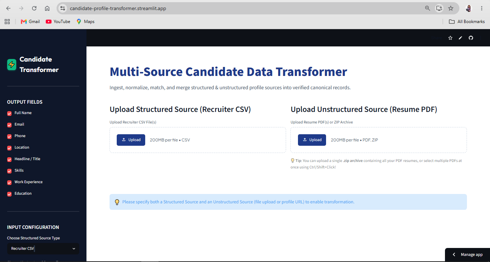
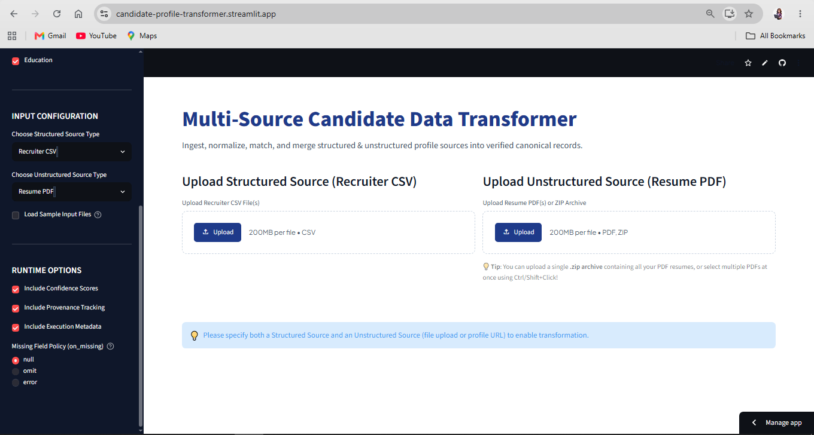
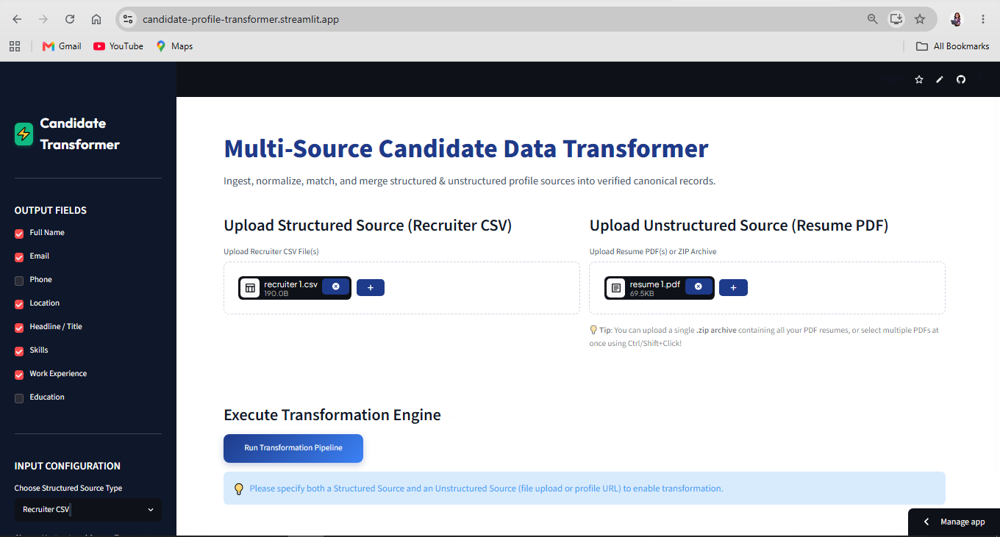
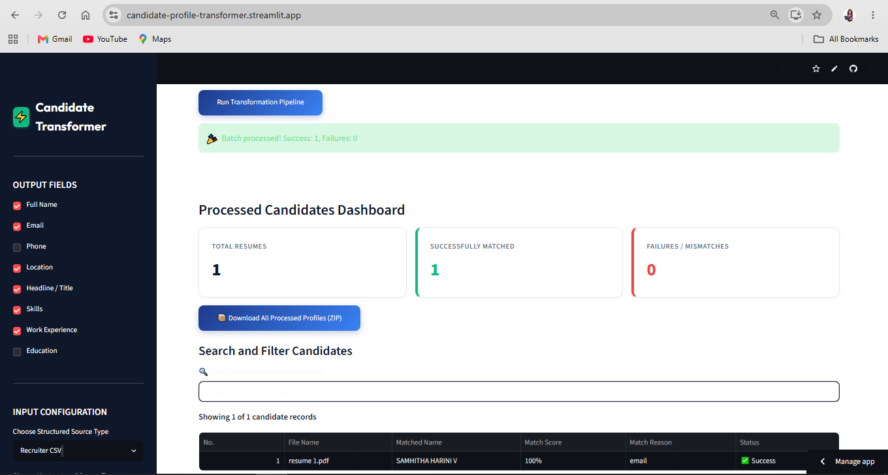
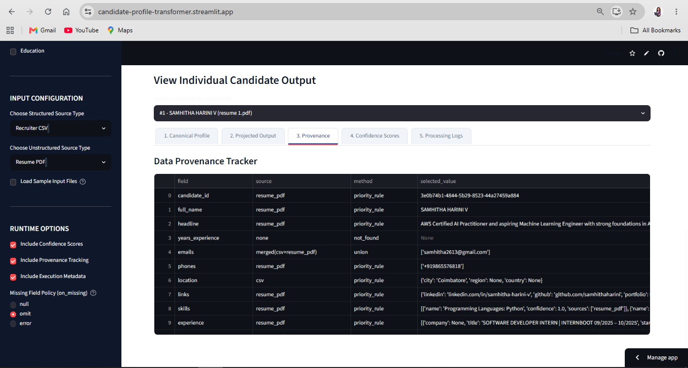

# Multi-Source Candidate Data Transformer

A runtime-configurable candidate profile transformation engine built for the **Eightfold Engineering Intern Assignment (Jul–Dec 2026)**.

The application ingests candidate information from multiple structured and unstructured sources, normalizes inconsistent values, merges duplicate candidate records, tracks provenance for every field, assigns confidence scores, and generates a single canonical candidate profile.

---

# Live Demo

Streamlit Application

https://candidate-profile-transformer.streamlit.app/

---

# Problem Statement

Recruitment data arrives from different systems and formats.

Examples:

- Recruiter CSV
- ATS JSON
- Resume PDF
- LinkedIn Profile
- GitHub Profile
- Recruiter Notes

Every source may contain

- missing fields
- duplicate information
- conflicting values
- different field names
- inconsistent formatting

The objective is to transform these heterogeneous sources into one trustworthy canonical profile.

---

# Solution Overview

The project follows a deterministic transformation pipeline.

```text
                USER

                  │

                  ▼

        Select Runtime Sources
 (Structured + Unstructured)

                  │

                  ▼

        Upload Candidate Files
        CSV / JSON / PDF / URL

                  │

                  ▼

          Source Detection

                  │

                  ▼

          Field Extraction

                  │

                  ▼

      Data Normalization Engine

      • Emails
      • Phones (E.164)
      • Skills
      • Links
      • Locations
      • Dates

                  │

                  ▼

      Candidate Matching Engine

      Match using

      • Email
      • Phone
      • Name

                  │

                  ▼

      Merge & Conflict Resolver

      Select best value

      Track source

      Store merge reason

                  │

                  ▼

      Confidence Engine

      Field Confidence

      Overall Confidence

                  │

                  ▼

      Provenance Generator

      Every field stores

      • selected source

      • selection method

      • selected value

                  │

                  ▼

     Runtime Projection Layer

     Apply user configuration

     ✔ Include fields

     ✔ Omit fields

     ✔ Rename fields

     ✔ Missing value policy

                  │

                  ▼

          Schema Validation

                  │

                  ▼

      Canonical JSON Output
```

---

# Features

- Supports multiple structured and unstructured sources
- Runtime configurable transformation
- Canonical profile generation
- Automatic normalization
- Candidate matching
- Merge conflict resolution
- Provenance tracking
- Confidence scoring
- Processing logs
- Batch resume processing
- Download processed candidate profiles

---

# Supported Sources

## Structured Sources

- Recruiter CSV
- ATS JSON

## Unstructured Sources

- Resume PDF
- LinkedIn URL
- GitHub URL
- Recruiter Notes (.txt)

---

# Canonical Output

The generated profile contains

- Candidate ID
- Name
- Emails
- Phones
- Location
- Links
- Headline
- Skills
- Experience
- Education
- Provenance
- Confidence Scores
- Execution Metadata

---

# Runtime Configuration

The application supports runtime configuration without changing code.

Users can

- Choose structured source
- Choose unstructured source
- Select output fields
- Include confidence scores
- Include provenance
- Include execution metadata
- Select missing value policy

Supported missing value policies

- null
- omit
- error

---

# Merge Strategy

When duplicate information exists,

Priority is assigned using deterministic rules.

Example

Resume > ATS > Recruiter CSV

Arrays

- Union merge
- Remove duplicates

Missing values

- Never invented
- Always deterministic

---

# Normalization

The engine normalizes

- Phone numbers → E.164
- Emails
- Canonical skills
- URLs
- Locations
- Dates

---

# Provenance Tracking

Every output field records

- selected source
- selected value
- merge method

making the transformation completely explainable.

---

# Confidence Engine

Confidence is calculated for

- individual fields
- overall candidate profile

based on

- source reliability
- field agreement
- completeness
- normalization success

---

# Tech Stack

Frontend

- Streamlit

Backend

- Python 3

Libraries

- Pandas
- PyMuPDF
- Requests
- BeautifulSoup
- JSON
- Regex

---

# Project Structure

```
candidate-profile-transformer/

│

├── app.py

├── parsers/

├── engine/

├── utils/

├── config/

├── schemas/

├── assets/

├── tests/

├── requirements.txt

└── README.md
```

---

# Running Locally

## Clone Repository

```bash
git clone https://github.com/samhithaharini/candidate-profile-transformer.git

cd candidate-profile-transformer
```

---

## Create Virtual Environment

Windows

```bash
python -m venv venv

venv\Scripts\activate
```

Linux / Mac

```bash
python3 -m venv venv

source venv/bin/activate
```

---

## Install Dependencies

```bash
pip install -r requirements.txt
```

---

## Run Application

```bash
streamlit run app.py
```

Application opens automatically at

```
http://localhost:8501
```

---

# Sample Workflow

1. Select Structured Source
2. Select Unstructured Source
3. Upload candidate files
4. Configure runtime options
5. Run Transformation Pipeline
6. View canonical profile
7. View provenance
8. View confidence scores
9. Download processed output

---

# Screenshots

## Home Page



---



---

## Processing Dashboard



---

## Canonical Output & Provenance



---



---

# Assignment Requirements Covered

✔ Structured Source

✔ Unstructured Source

✔ Runtime Configuration

✔ Canonical Schema

✔ Normalization

✔ Candidate Matching

✔ Merge Strategy

✔ Provenance

✔ Confidence Scores

✔ Validation

✔ Processing Logs

✔ Batch Processing

✔ Download Output

✔ Streamlit Interface

---
